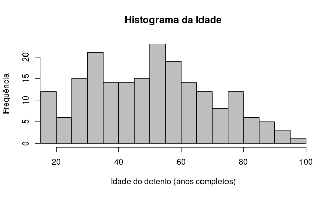
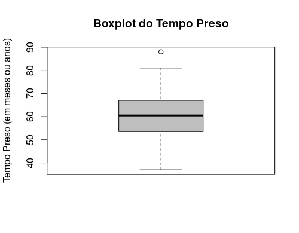
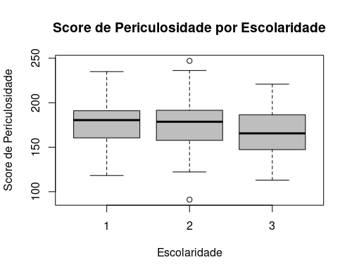
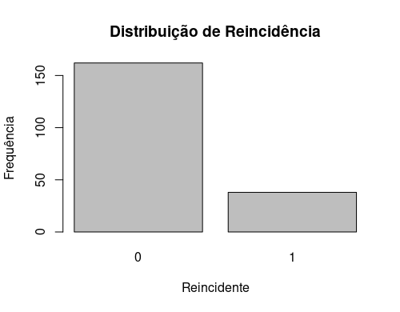

# AnaliseExploratoria

Atividade - Prática Estatística I

## O que é um "Commit"?

Um commit é o ato de registrar oficialmente as alterações feitas em um projeto dentro do repositório local. Cada commit salva um instantâneo dos arquivos, inclui uma mensagem explicando as mudanças e contém informações como a data, hora e autor da modificação.

## Histograma da Variável "idade"

A análise do histograma da idade dos detentos mostra uma distribuição que não é simétrica. A faixa de maior frequência de indivíduos está localizada no intervalo entre 50 e 55 anos. Há também uma segunda concentração muito significativa de detentos na faixa dos 30-35 anos, com uma contagem quase tão alta quanto a do pico principal. O histograma exibe uma evidente assimetria à direita.

## Boxplot da Variável "tempo_preso"

O boxplot da var. "tempo_preso" mostra uma mediana de aproximadamente 60 meses, com os 50% centrais dos dados concentrados entre 54 e 67 meses. A distribuição apresenta uma leve assimetria à direita, indicada pela maior variabilidade nos valores mais altos, e revela a presença de um outlier superior, próximo de 90 meses.

## Boxplot da Variável "score_periculosidade" pela Variável "escolaridade"

O boxplot do "Score de Periculosidade" por escolaridade mostra que detentos com ensino fundamental e ensino médio têm medianas semelhantes e mais altas (aprox. 175-180). Em contrapartida, detentos com ensino superior possuem uma mediana visivelmente inferior (aprox. 165). Destaca-se que apenas o grupo de ensino médio apresenta valores a existência de um outlier.

## Gráfico de barras da Variável "reincidente" 

Observa-se que a categoria "não reincidente" é predominante na amostra, com uma frequência absoluta muito alta, próxima de 160 indivíduos. Em contrapartida, a categoria "reincidente" é significativamente menor, registrando uma frequência de aproximadamente 40 indivíduos.

## Medidas de Tendência Central e de Dispersão

### Média

A média aritmética representa o valor central em torno do qual os dados se distribuem. É obtida somando todos os valores observados e dividindo o resultado pelo número total de observações.

### Mediana

A mediana é o valor que ocupa a posição central dos dados quando estão organizados em ordem crescente. Quando o número de observações é ímpar, ela corresponde ao valor do meio; quando é par, é a média dos dois valores centrais.

### Quartis

Os quartis dividem o conjunto de dados ordenados em quatro partes iguais. O primeiro quartil (Q1) representa o valor abaixo do qual estão 25% das observações, o segundo quartil (Q2) corresponde à mediana (50%), e o terceiro quartil (Q3) indica o valor abaixo do qual estão 75% dos dados. 

### Variância

A variância mede o grau de dispersão dos valores em relação à média. Indica o quanto os dados se afastam, em média, do valor central, considerando as diferenças elevadas ao quadrado.

### Desvio Padrão

O desvio padrão expressa o grau de dispersão dos dados em torno da média, mas na mesma unidade da variável original. Quanto maior o desvio padrão, mais os valores se afastam da média; quanto menor, mais próximos estão dela.

### Amplitude

A amplitude total representa a diferença entre o maior e o menor valor observado. É uma medida simples de dispersão que mostra a extensão total dos dados da amostra.

